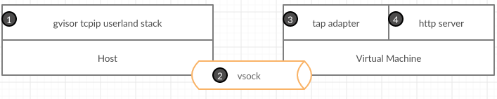

# gvisor-tap-vsock


A replacement for [libslirp](https://gitlab.com/qemu-project/libslirp) and [VPNKit](https://github.com/moby/vpnkit), written in pure Go.
It is based on the network stack of [gVisor](https://github.com/google/gvisor/tree/master/pkg/tcpip).

Compared to libslirp, gvisor-tap-vsock brings a configurable DNS server and dynamic port forwarding.

It can be used with QEMU, Hyperkit, Hyper-V and User Mode Linux.

## Build

```
make
```

## Run with QEMU (Linux or macOS)

Usually with QEMU, to not run as root, you would have to use `-netdev user,id=n0`.
With this project, this is the same but you have to run a daemon on the host.

There 2 ways for the VM to communicate with the daemon: with a tcp port or with a unix socket.

- With gvproxy and the VM discussing on a tcp port:
```
(terminal 1) $ bin/gvproxy -debug -listen unix:///tmp/network.sock -listen-qemu tcp://0.0.0.0:1234
(terminal 2) $ qemu-system-x86_64 (all your qemu options) -netdev socket,id=vlan,connect=127.0.0.1:1234 -device virtio-net-pci,netdev=vlan,mac=5a:94:ef:e4:0c:ee
```

- With gvproxy and the VM discussing on a unix socket:
```
(terminal 1) $ bin/gvproxy -debug -listen unix:///tmp/network.sock -listen-qemu unix:///tmp/qemu.sock
(terminal 2) $ bin/qemu-wrapper /tmp/qemu.sock qemu-system-x86_64 (all your qemu options) -netdev socket,id=vlan,fd=3 -device virtio-net-pci,netdev=vlan,mac=5a:94:ef:e4:0c:ee
```

Starting from Qemu version 7.2.0 it is possible to run w/o a wrapper:
```
(terminal 1) $ bin/gvproxy -debug -listen unix:///tmp/network.sock -listen-qemu unix:///tmp/qemu.sock
(terminal 2) $ qemu-system-x86_64 (all your qemu options) -netdev stream,id=vlan,addr.type=unix,addr.path=/tmp/qemu.sock -device virtio-net-pci,netdev=vlan,mac=5a:94:ef:e4:0c:ee
```

## Run with User Mode Linux

```
(terminal 1) $ bin/gvproxy -debug -listen unix:///tmp/network.sock -listen-bess unixpacket:///tmp/bess.sock
(terminal 2) $ linux.uml vec0:transport=bess,dst=/tmp/bess.sock,depth=128,gro=1,mac=5a:94:ef:e4:0c:ee root=/dev/root rootfstype=hostfs init=/bin/bash mem=2G
(terminal 2: UML)$ ip addr add 192.168.127.2/24 dev vec0
(terminal 2: UML)$ ip link set vec0 up
(terminal 2: UML)$ ip route add default via 192.168.127.254
```

More docs about the User Mode Linux with BESS socket transport: https://www.kernel.org/doc/html/latest/virt/uml/user_mode_linux_howto_v2.html#bess-socket-transport

## Run with [vfkit](https://github.com/crc-org/vfkit)

With vfkit 0.1.0 or newer, gvproxy can be used without any helper running in the VM:

```
(terminal 1) $ bin/gvproxy -debug -listen unix:///tmp/network.sock --listen-vfkit unixgram:///tmp/vfkit.sock
(terminal 2) $ vfkit (all your vfkit options) --device virtio-net,unixSocketPath=/tmp/vfkit.sock,mac=5a:94:ef:e4:0c:ee
```

## Run with vsock

Made for Windows but also works for Linux and macOS with vfkit.

### Host

#### Windows prerequisites

```
$service = New-Item -Path "HKLM:\SOFTWARE\Microsoft\Windows NT\CurrentVersion\Virtualization\GuestCommunicationServices" -Name "00000400-FACB-11E6-BD58-64006A7986D3"
$service.SetValue("ElementName", "gvisor-tap-vsock")
```

More docs: https://docs.microsoft.com/en-us/virtualization/hyper-v-on-windows/user-guide/make-integration-service

In the VM, be sure to have `hv_sock` module loaded.

#### Linux prerequisites

On Fedora 32, it worked out of the box. On others distros, you might have to look at https://github.com/mdlayher/vsock#requirements.

#### macOS prerequisites


`vfkit` must be started with a vsock device: `--device virtio-vsock,port=1024,socketURL=/tmp/vfkit-vsock-1024.sock`
Then you can launch `gvproxy` with the following listen argument:
`--listen unix:///tmp/vfkit-vsock-1024.sock`

#### Run

```
(host) $ sudo bin/gvproxy -debug -listen vsock://:1024 -listen unix:///tmp/network.sock
```

### VM

With a container:
```
(vm) # docker run -d --name=gvisor-tap-vsock --privileged --net=host -it quay.io/crcont/gvisor-tap-vsock:latest
(vm) $ ping -c1 192.168.127.1
(vm) $ curl http://redhat.com
```

With the executable:
```
(vm) # ./gvforwarder -debug
```

## Services

### API

When `gvproxy` is started with the `--listen` option, it exposes a HTTP API on the host.
This API can be used with curl.

```
$ gvproxy --listen unix:///tmp/network.sock .... &

$ curl  --unix-socket /tmp/network.sock http:/unix/stats
{
  "BytesSent": 0,
  "BytesReceived": 0,
  "UnknownProtocolRcvdPackets": 0,
  "MalformedRcvdPackets": 0,
...
```

### Gateway

The executable running on the host runs a virtual gateway that can be used by the VM.
It runs a DHCP server. It allows VMs to configure the network automatically (IP, MTU, DNS, search domain, etc.).

### DNS

The gateway also runs a DNS server. It can be configured to serve static zones.

Activate it by changing the `/etc/resolv.conf` file inside the VM with:
```
nameserver 192.168.127.1
```

### Port forwarding

Dynamic port forwarding is supported over the host HTTP API when `gvproxy` was
started with `--listen`, but also in the VM over http://192.168.127.1:80.

Expose a port:
```
$ curl  --unix-socket /tmp/network.sock http:/unix/services/forwarder/expose -X POST -d '{"local":":6443","remote":"192.168.127.2:6443"}'
```

Unexpose a port:
```
$ curl  --unix-socket /tmp/network.sock http:/unix/services/forwarder/unexpose -X POST -d '{"local":":6443"}'
```

List exposed ports:
```
$ curl  --unix-socket /tmp/network.sock http:/unix/services/forwarder/all | jq .
[
  {
    "local": ":2222",
    "remote": "192.168.127.2:22"
  },
  {
    "local": ":6443",
    "remote": "192.168.127.2:6443"
  }
]

```

### Tunneling

The HTTP API exposed on the host can be used to connect to a specific IP and port inside the virtual network.
A working example for SSH can be found [here](https://github.com/containers/gvisor-tap-vsock/blob/master/cmd/ssh-over-vsock).

## Limitations

* ICMP is not forwarded outside the network.

## Performance

Using iperf3, it can achieve between 1.6 and 2.3Gbits/s depending on which side the test is performed (tested with a mtu of 4000 with QEMU on macOS).

## How it works with vsock

### Internet access


0. A tap network interface is running in the VM. It's the default gateway.
1. User types `curl redhat.com`
2. Linux kernel sends raw Ethernet packets to the tap device.
3. Tap device sends these packets to a process on the host using [vsock](https://wiki.qemu.org/Features/VirtioVsock)
4. The process on the host maintains both internal (host to VM) and external (host to Internet endpoint) connections. It uses regular syscalls to connect to external endpoints.

This is the same behaviour as [slirp](https://wiki.qemu.org/index.php/Documentation/Networking#User_Networking_.28SLIRP.29).

### Expose a port



1. The process on the host binds the port 80.
2. Each time, a client sends a http request, the process creates and sends the appropriate Ethernet packets to the VM.
3. The tap device receives the packets and injects them in the kernel.
4. The http server receives the request and send back the response.
